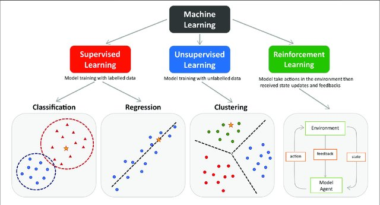
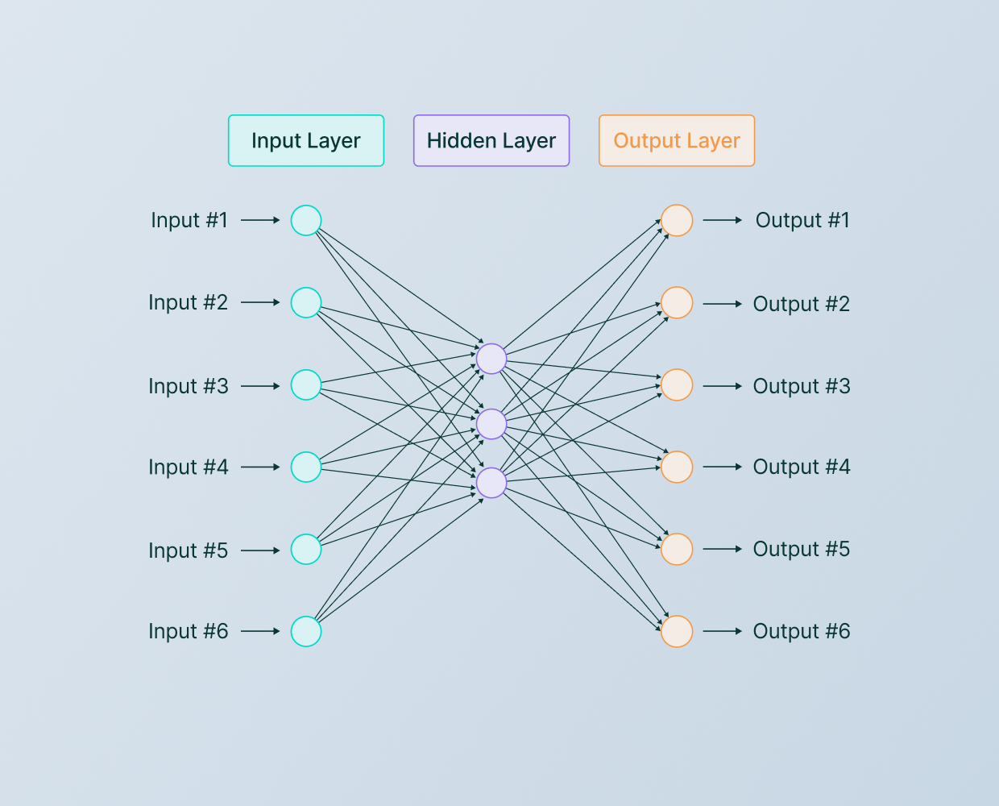
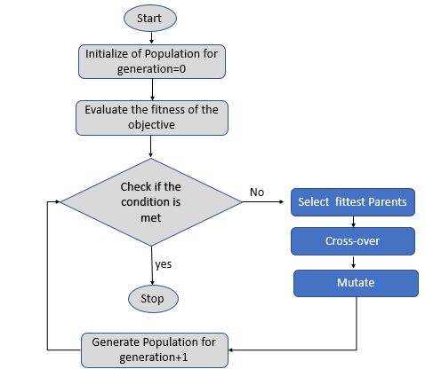

### Genetic Algorithms GA class

This repository contains the practical for the Genetic Algorithms (GA) class

### What is Genetic Algorithms (GA)

- Method used in artificial intelligence and computing

- Used for finding optimized solutions to search problems based on the theory of natural selection and evolutionary biology

- Genetic algorithms are excellent for searching through large and complex data sets

- Is a model or abstraction of biological evolution based on Charles Darwin's theory of natural selection Developed by John Holland in the 1960s and 1970s

    

### Advantages and Disadvantages of Genetic Algorithms (GA)

- Advantages of GA:

1. Parallelism
2. Handles large, poorly understood search spaces easily
3. Easy to discover global optimum
4. Resistant to becoming trapped in local optima
5. Good for multi-modal problems Returns a suite of solutions

- Disadvantages of GA:

1. Identifying fitness function
2. Definition of representation for the problem
3. The problem of choosing the various parameters like the size of the population,
mutation rate, cross over rate, the selection method and its strength.
4. Cannot use gradients
5. No effective terminator
6. Require large number of response (fitness) function evaluations

### Application of Genetic Algorithms (GA)

1. Design Neural networks both architecture and weights
2. Traveling salesman problem TSP
3. Scheduling
4. Network design and routing i.e Network routing
5. Signal processing (filter design)

### AI vs. Machine Learning vs. Neural Networks vs. Deep Learning vs. Genetic Genetic Algorithms

    

- Artificial Intelligence

Mimics cognitive functions that humans associate with other human minds, such as learning and problem solving

- Machine Learning

Subset of AI that includes algorithms that parse data, learn
from that data, and then apply what they’ve learned to make informed
decisions:
1. Supervised learning: learn to predicate outcomes with help from data scientists
2. Unsupervised learning: machine learn to predicate outcomes on there go by recognizing
patterns in input data when machines can draw meaningful inferences from large volumes of
data set they demonstrate the ability to learn deeply

    

- Neural Networks

Mimic the human brain through an artificial neural
networks. Contains nodes in different layers that are connected and
communicate with each other to make sense of voluminous input data

    

- Deep Learning

Subset of machine learning in which multilayered neural networks learn from vast amounts of data

    

- Genetic Algorithms

Method used in artificial intelligence and computing used for finding optimized (maximum or minimum) solutions to search problems based on the theory of natural selection and evolutionary biology

    

### Environment Setup

1. VS Code
2. Python-3
3. Anaconda (Optional)
4. PyGad
5. PyGame (Optional)

### Technologies

Some solutions are using libraries like PyGad while others not (Pure Python implementation). Some problems' solutions are both using libraries and Pure Python.

The Libraries which are used

1. PyGad (Genetic Python library)
2. PyGame (Used for animation purpose)

### Problems

1. Linear Model
2. Square function
3. Traveling salesman problem (TSP)
4. Simple Linear Regression

#### PyGad

Is an open-source Python library for building the genetic algorithm and optimizing machine learning algorithms. It works with Keras and PyTorch. <a href="https://pygad.readthedocs.io/en/latest/">More</a>

#### GA class parameters in PyGad library

These variables are assigned values and passed to GA class

<table border="2">
    <tr>
        <th>
            Parameter
        </th>
        <th>
            Description
        </th>
        <th>
            Usage Example
        </th>
    </tr>
    <tr>
        <td>
            fitness_function
        </td>
        <td>
            Declare your fitness function and assign it to 
        </td>
        <td>
            fitness_function = fitness_func
        </td>
    </tr>
    <tr>
        <td>
            num_generations
        </td>
        <td>
            Declare number of generation
        </td>
        <td>
            num_generations = 50
        </td>
    </tr>
    <tr>
        <td>
            num_parents_mating
        </td>
        <td>
            Declare number of parents mating
        </td>
        <td>
            num_parents_mating = 4
        </td>
    </tr>
    <tr>
        <td>
            sol_per_pop
        </td>
        <td>
            Number of solutions (i.e. chromosomes) within the population. This parameter has no action if initial_population parameter exists
        </td>
        <td>
            sol_per_pop = 8
        </td>
    </tr>
    <tr>
        <td>
            num_genes
        </td>
        <td>
            Number of genes in the solution/chromosome. It is not needed if the user feeds the initial population to the initial_population parameter
        </td>
        <td>
            num_genes = 4
        </td>
    </tr>
    <tr>
        <td>
            init_range_low
            init_range_high
        </td>
        <td>
            Mutation value is selected randomly init_range_low and init_range_high from the range specified by the
        </td>
        <td>
            init_range_low = 0
            init_range_high = 6
        </td>
    </tr>
    <tr>
        <td>
            parent_selection_type
        </td>
        <td>
            Parent selection type are:
            <ol>
                <li>steady-state selection (sss)</li>
                <li>roulette wheel selection (rws)</li>
                <li>stochastic universal selection (sus)</li>
                <li>rank selection (rank selection)</li>
                <li>random selection (random)</li>
                <li>tournament selection (tournament)</li>
            </ol>
        </td>
        <td>
            parent_selection_type = "sss"
        </td>
    </tr>
    <tr>
        <td>
            keep_parents
        </td>
        <td>
            Number of parents to keep in the current population
-1 (default) means to keep all parents in the next population
0 means keep no parents in the next population
        </td>
        <td>
            keep_parents = 1
        </td>
    </tr>
    <tr>
        <td>
            crossover_type
        </td>
        <td>
            Types of the crossover operation are:
            <ol>
                <li>single-point crossover (single_point)</li>
                <li>two points crossover (two_points)</li>
                <li>uniform crossover (uniform)</li>
                <li>scattered crossover (scattered)</li>
            </ol>
        </td>
        <td>
            crossover_type = "single_point"
        </td>
    </tr>
    <tr>
        <td>
            mutation_type
        </td>
        <td>
            Mutation operations are:
            <ol>
                <li>random mutation (random)</li>
                <li>swap mutation (swap)</li>
                <li>inversion mutation (inversion)</li>
                <li>scramble mutation (scramble)</li>
                <li>adaptive mutation (adaptive)</li>
            </ol>
        </td>
        <td>
            mutation_type = "random"
        </td>
    </tr>
    <tr>
        <td>
            mutation_percent_genes
        </td>
        <td>
            Percentage of genes to mutate, it must be >0 and <=100
        </td>
        <td>
            mutation_percent_genes = 10
        </td>
    </tr>
</table>

* PyGad initialize_population with the following (init_range_low, init_range_high, allow_duplicate_genes, True, gene_type)

* For more information about parameters visit <a href="https://pygad.readthedocs.io/en/latest/">PyGad Documentation</a>

### GA Pattern

The pattern for any GA are theses steps:

1. Declare input(s)
2. Declare output
3. Fitness_function
4. Crossover and/or mutation

### Crossover types

### Mutation types
