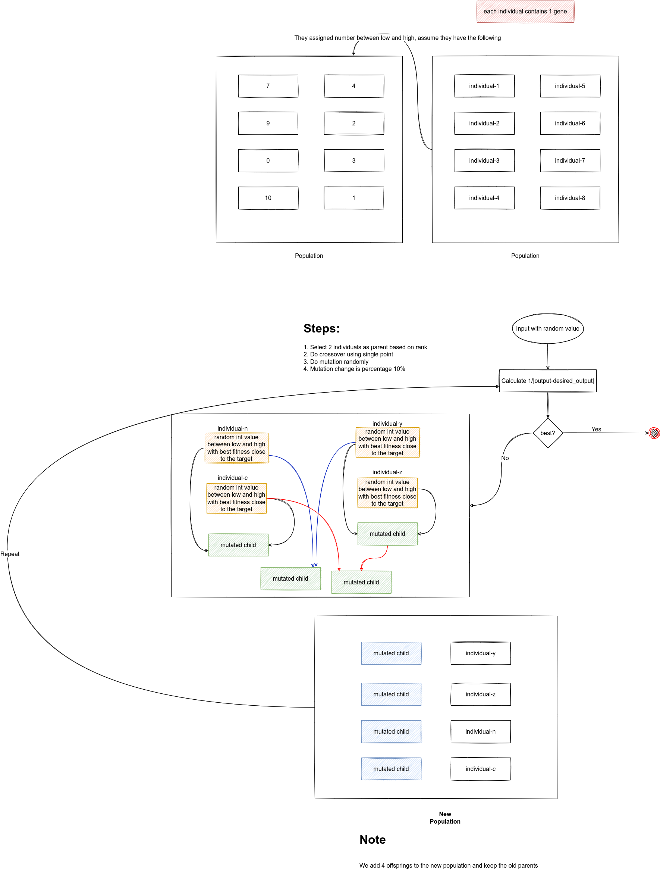

### Linear Model

Linear model `y = w1x1 + w2x2 + w3x3 + w4x4 + w5x5 + w6x6`, you specify the output `y` and you have x values and weights. The idea here how to adjust weights to get the correct or close to the output.

This is simple problem which you can use Machine Learning, Artificial Neural Networks (ANN) and Genetic Algorithm

### How does GA work for Linear Model?

1. First you start with initial weights
2. Calculate the fitness function
3. Select 4 parents based  is steady-state selection (sss)
4. Do crossover single_point
5. Mutation is random with 10%
6. repeat steps 2-5 until getting the maximum output


<div style="border:2px solid gray;">
    
</div>

### Fitness function

We need to calculate the that maximize fitness by calculating minimum error using absolute difference, to get max result 
we use `1/absolute_difference` (inverse to make the minimum error max)

```py
def fitness_func(weights, weight_idx):
    """
        weights are array of weights
        this lines calculates x for it's weights with the same index
        examples:
        weights: [w1,w2,w3,w4,w5,w6]
        inputs: [4,-2,3.5,5,-11,-4.7]
        output = 4*w1 + (-2)*w2 + 3.5*w3 + 5*w4 + (-11)*w5 + (-4.7)*w6

        Then calculate the absolute difference and inverse to make the minimum error max
    """
    output = numpy.sum(weights*inputs)
    return 1.0/numpy.abs(output - desired_output)
```

### Parameters

<i><ins>Note: The parameters which are used for the implementation, you can fine tune them and see the output</ins></i>

<table border="2">
    <tr>
        <td>num_generations</td>
        <td>50</td>
    </tr>
    <tr>
        <td>num_parents_mating</td>
        <td>4</td>
    </tr>
    <tr>
        <td>sol_per_pop</td>
        <td>8</td>
    </tr>
    <tr>
        <td>num_genes</td>
        <td>len(inputs)</td>
    </tr>
    <tr>
        <td>init_range_low</td>
        <td>-2</td>
    </tr>
    <tr>
        <td>init_range_high</td>
        <td>5</td>
    </tr>
    <tr>
        <td>parent_selection_type</td>
        <td>sss</td>
    </tr>
    <tr>
        <td>keep_parents</td>
        <td>1</td>
    </tr>
    <tr>
        <td>crossover_type</td>
        <td>single_point</td>
    </tr>
    <tr>
        <td>mutation_type</td>
        <td>random</td>
    </tr>
    <tr>
        <td>mutation_percent_genes</td>
        <td>10</td>
    </tr>
</table>

### Full code

```py
# This script shows the GA using PyGad for this Linear:
# y = w1x1 + w2x2 + w3x3 + w4x4 + w5x5 + w6x6

import pygad
import numpy

# represents x's values
inputs = [4,-2,3.5,5,-11,-4.7]
desired_output = 44

def fitness_func(weights, weight_idx):
    """
        weights are array of weights
        this lines calculates x for it's weights with the same index
        examples:
        weights: [w1,w2,w3,w4,w5,w6]
        inputs: [4,-2,3.5,5,-11,-4.7]
        output = 4*w1 + (-2)*w2 + 3.5*w3 + 5*w4 + (-11)*w5 + (-4.7)*w6

        Then calculate the absolute difference and inverse to make the minimum error max
    """
    output = numpy.sum(weights*inputs)
    return 1.0/numpy.abs(output - desired_output)

# Parameters
fitness_function = fitness_func

num_generations = 50
num_parents_mating = 4

sol_per_pop = 8

num_genes = len(inputs)

init_range_low = -2
init_range_high = 5

parent_selection_type = "sss"

keep_parents = 1

crossover_type = "single_point"

mutation_type = "random"

mutation_percent_genes = 10

ga_instance = pygad.GA(num_generations=num_generations,
                       num_parents_mating=num_parents_mating,
                       fitness_func=fitness_function,
                       sol_per_pop=sol_per_pop,
                       num_genes=num_genes,
                       init_range_low=init_range_low,
                       init_range_high=init_range_high,
                       parent_selection_type=parent_selection_type,
                       keep_parents=keep_parents,
                       crossover_type=crossover_type,
                       mutation_type=mutation_type,
                       mutation_percent_genes=mutation_percent_genes)

ga_instance.run()

# ga_instance.plot_result()

print("-------------------------------Result--------------------------------")

solution, solution_fitness, solution_idx = ga_instance.best_solution()
print("Parameters of the best weights : {solution}".format(solution=solution))
print("Fitness value of the best weightes = {solution_fitness}".format(solution_fitness=solution_fitness))

prediction = numpy.sum(numpy.array(inputs)*solution)
print("Predicted output based on the best weights : {prediction}".format(prediction=prediction))
```
