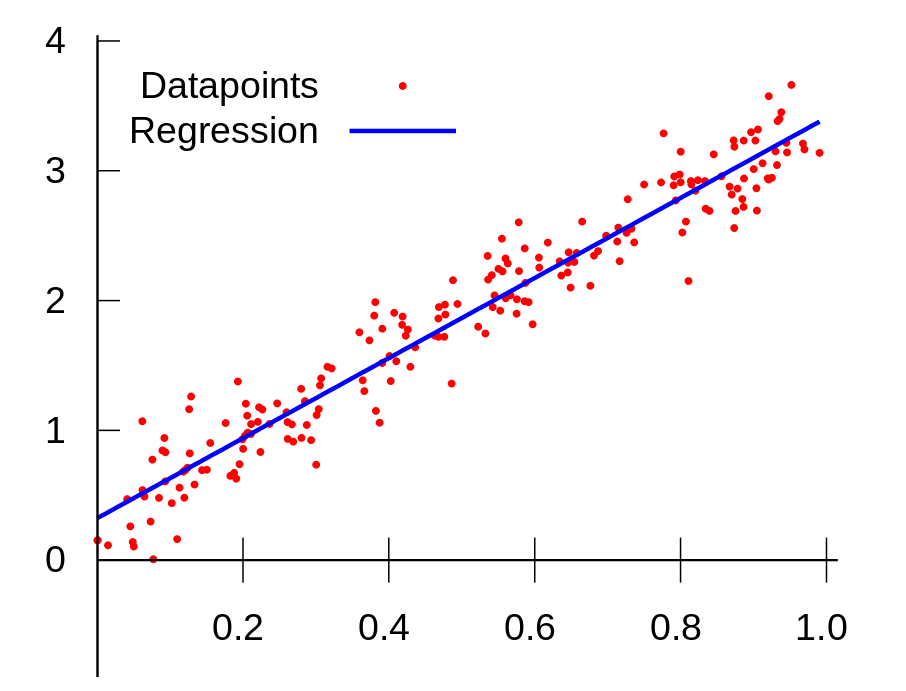
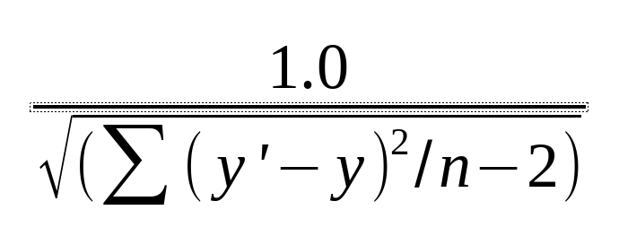

### Linear Regression using GA

- Linear regression attempts to model the relationship between two variables by fitting a linear equation to observed data
- We can use linear regression to solve linear equation Y=aX+b, Meanwhile, a is the slope of the line
another representation of Y=mX + b, or Y=&#952;1X + &#952;0

- The most common method for fitting a regression line is the method of least-squares
- For more http://www.stat.yale.edu/Courses/1997-98/101/linreg.htm

<div align="center">
    
</div>

### Goal of Linear regression

To find a continuous or real number and best line fit between Y=aX+b

### Dataset

It's using a naive dataset based on the age and glucose

|Ages | Glucose|
|-----|--------|
|43   | 99|
|21   | 65|
|25   | 79|
|42   | 75|
|57   | 87| 
|59   | 81|
    
The task is find appropriate a and b parameters for Y = aX + b
, and answer a query what would be the value of Y when X = 65

### GA Linear Regression fitness function

<div align="center">
    
</div>

### Machine Linear Regression

You can check the difference between the GA linear regression and Machine linear regression by using `sklearn.linear_model` https://scikit-learn.org/stable/modules/generated/sklearn.linear_model.LinearRegression.html


### Full code

```py
"""
This script represents the linear regression using pygad library
for ages | glucose
    43   | 99
    21   | 65
    25   | 79
    42   | 75
    57   | 87  
    59   | 81
    
The task is find appropriate a and b parameters for Y = aX + b
, And calculate the Y when X = 65
"""

import pygad
import math

inputs = [43, 21, 25, 42, 57, 59]
outputs = [99, 65, 79, 75, 87, 81]

def individual_fitness(parameters):
    global inputs
    global outputs

    predicted_outputs = []
    for i in inputs:
      predicted_outputs.append(i * parameters[0] + parameters[1])
    sum_diff = 0.0
    for i in range(len(inputs)):
      sum_diff += (outputs[i]-predicted_outputs[i])**2
    return math.sqrt(sum_diff/(len(outputs)-2))


def fitness_func(solutions, _):
    return 1.0/individual_fitness(solutions)

ga_instance = pygad.GA(num_generations=100,
                       num_parents_mating=4,
                       fitness_func=fitness_func,
                       sol_per_pop=5000,
                       num_genes=2,
                       init_range_low=-50,
                       init_range_high=50,
                       parent_selection_type="rank",
                       keep_parents=1,
                       crossover_type="uniform",
                       mutation_type="random",
                       mutation_percent_genes=10)

ga_instance.run()

ga_instance.plot_result()

print("-------------------------------Result--------------------------------")

solution, solution_fitness, solution_idx = ga_instance.best_solution()
print("Parameters of the best paramters : {solution}".format(solution=solution))

print("Fitness value of the best paramters = {solution_fitness}".format(solution_fitness=solution_fitness))
print("When X {} Y equals: {}".format(65, (65*solution[0] + solution[1])))
```
