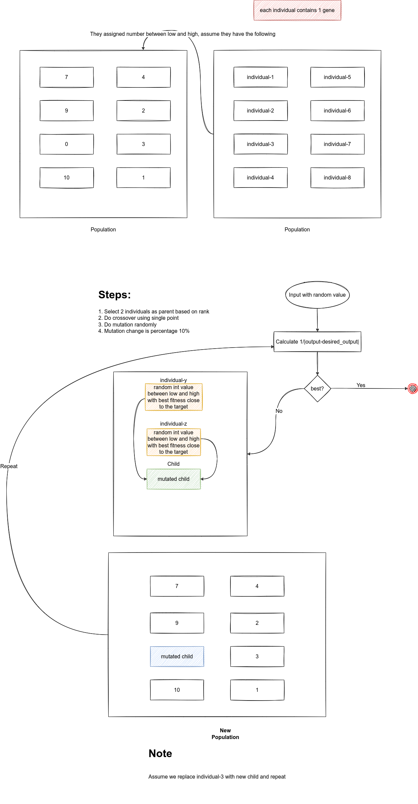

### Max square function

max square function: f(x) = x<sup>2</sup>

### How does GA work for Linear Model?

1. First you start with initial weights
2. Calculate the fitness function
3. Select 2 parents based  is rank
4. Do crossover single_point
5. Mutation is random with 10%
6. repeat steps 2-5 until getting the maximum output

<div style="border:2px solid gray;">
    
</div>

### Fitness function

We need to calculate the that maximize fitness by calculating minimum error using absolute difference, to get max result 
we use `1/absolute_difference` (inverse to make the minimum error max)

```py
def fitness_func(solutions, solution_idx):
    output = solutions[0]
    output *= output
    return 1.0/numpy.abs(output - desired_output)
```

### Parameters

<i><ins>Note: This is the parameters which are used for the implementation, you can fine tune them and see the output</ins></i>

<table border="2">
    <tr>
        <td>num_generations</td>
        <td>50</td>
    </tr>
    <tr>
        <td>num_parents_mating</td>
        <td>2</td>
    </tr>
    <tr>
        <td>sol_per_pop</td>
        <td>8</td>
    </tr>
    <tr>
        <td>num_genes</td>
        <td>1</td>
    </tr>
    <tr>
        <td>init_range_low</td>
        <td>0</td>
    </tr>
    <tr>
        <td>init_range_high</td>
        <td>10</td>
    </tr>
    <tr>
        <td>parent_selection_type</td>
        <td>rank</td>
    </tr>
    <tr>
        <td>keep_parents</td>
        <td>1</td>
    </tr>
    <tr>
        <td>crossover_type</td>
        <td>single_point</td>
    </tr>
    <tr>
        <td>mutation_type</td>
        <td>random</td>
    </tr>
    <tr>
        <td>mutation_percent_genes</td>
        <td>10</td>
    </tr>
</table>

### Full code

```py
# This script shows the GA using PyGad for this max function:
# y = x^2

import pygad
import numpy
import random

val = random.random()

desired_output = 64

def fitness_func(solutions, solution_idx):
    output = solutions[0]
    output *= output
    return 1.0/numpy.abs(output - desired_output)

# Parameters
fitness_function = fitness_func

num_generations = 50
num_parents_mating = 2

sol_per_pop = 8

num_genes = 1

init_range_low = 0
init_range_high = 10

parent_selection_type = "rank"

keep_parents = 1

crossover_type = "single_point"

mutation_type = "random"

mutation_percent_genes = 10

ga_instance = pygad.GA(num_generations=num_generations,
                       num_parents_mating=num_parents_mating,
                       fitness_func=fitness_function,
                       sol_per_pop=sol_per_pop,
                       num_genes=num_genes,
                       init_range_low=init_range_low,
                       init_range_high=init_range_high,
                       parent_selection_type=parent_selection_type,
                       keep_parents=keep_parents,
                       crossover_type=crossover_type,
                       mutation_type=mutation_type,
                       mutation_percent_genes=mutation_percent_genes)

ga_instance.run()

# ga_instance.plot_result()

print("-------------------------------Result--------------------------------")

solution, solution_fitness, solution_idx = ga_instance.best_solution()
print("Parameters of the best solution : {solution}".format(solution=solution))
print("Fitness value of the best solution = {solution_fitness}".format(solution_fitness=solution_fitness))

prediction = solution
print("Predicted output based on the best solution : {prediction}".format(prediction=prediction))
```