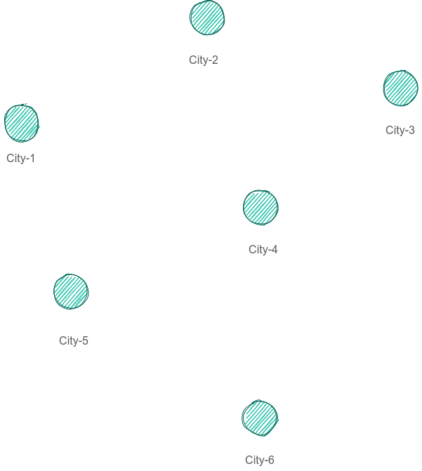
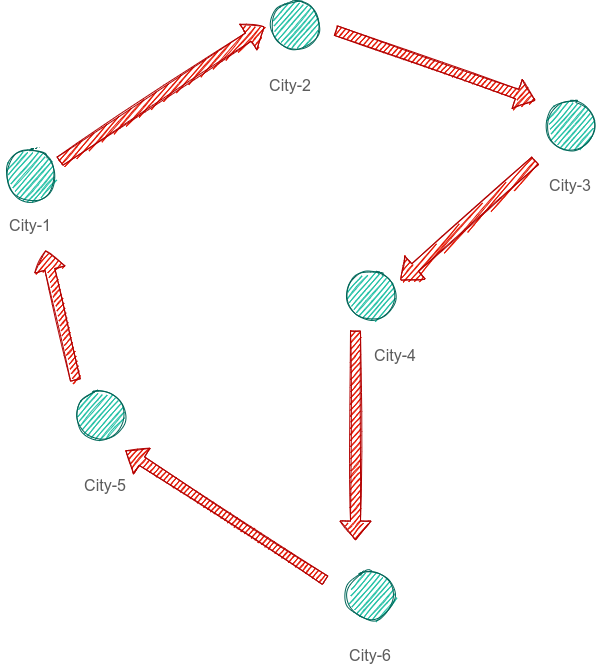
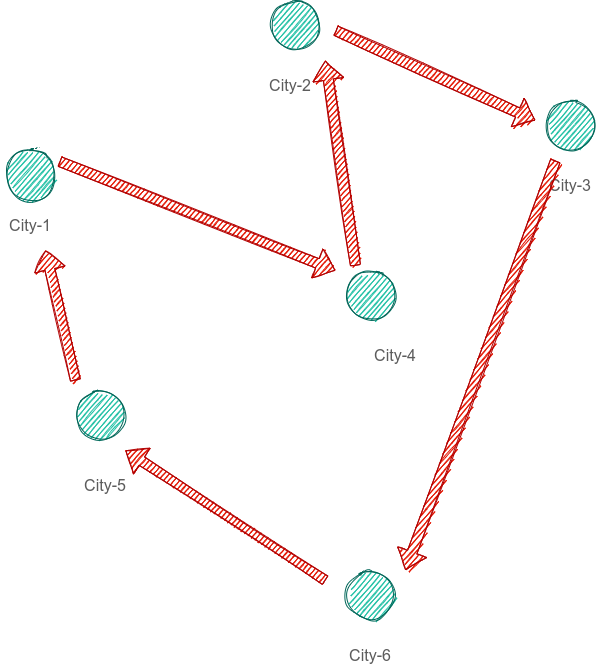
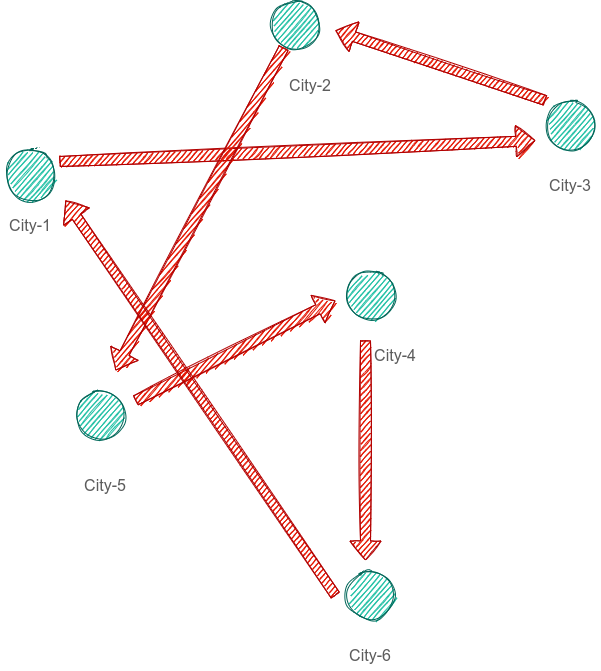
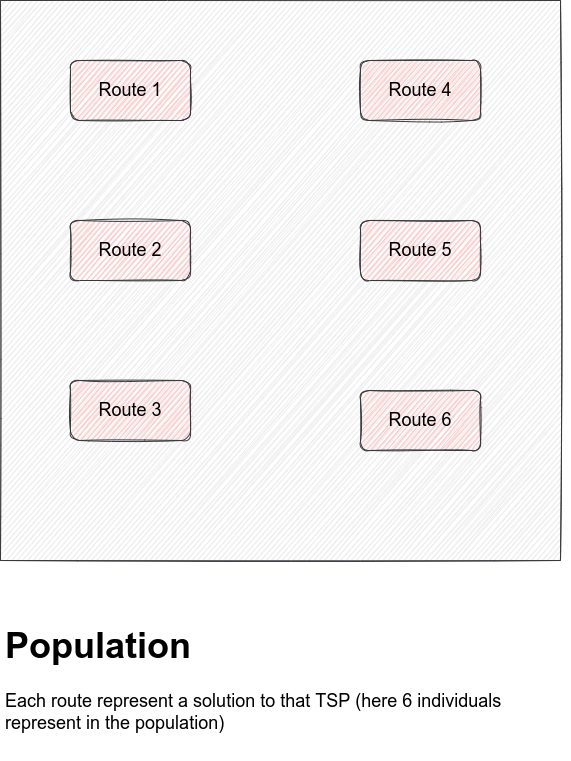

### Traveling salesman problem (TSP)

#### Definition 

Given a set of cities and the cost of travel (or distance) between each possible pairs, the TSP, is to find the best possible way of visiting all the cities and returning to the starting point that minimize the travel cost (or travel distance)

#### Complexity

Given n is the number of cities to be visited, the total number of possible routes covering all cities can be given as a set of feasible solutions of the TSP and is given as (n-1)!/2

#### Applications

- Vehicle routing
- Routing and Planning
- Scheduling
- And more!

#### GA properties

- Encoding: Permutation Encoding
- Crossover: Single point crossover
- Mutation: Order changing - two numbers are selected and exchanged
- Fitness function: the minimum distance

#### Implementation, Idea 1

- You have number of cities in (x,y) in list {(x1, y1), (x2, y2), …, (xn, yn)}
- X and Y used for calculate the euclidean distance between cities
- To access any city you just need index to point to that city:
    - 0 → city 1
    - 1 → city 2
    - N - 1 → city n

    

- The population consists of routes as individuals
- Each route consist of list of indices pointing to cities
- And each route represent different solutions

    <fieldset>
        <legend>Route-1</legend>
        
    </fieldset>

    <fieldset>
        <legend>Route-2</legend>
        
    </fieldset>

    <fieldset>
        <legend>Route-3</legend>
        
    </fieldset>

- And so on!

    <fieldset>
        <legend>Population</legend>
        
    </fieldset>

#### Implementation, Idea 2

- Rather than use X and Y we can add weights between others cities and represent as graph representation
    - V is the city
    - W It’s adjacency city
- Could we use adjacency matrix

### Implementations. Idea N

- You can think of any other representation in order to solve the TSP using GA

    

<ins><strong>Note: The current implementation using idea-1</strong></ins>